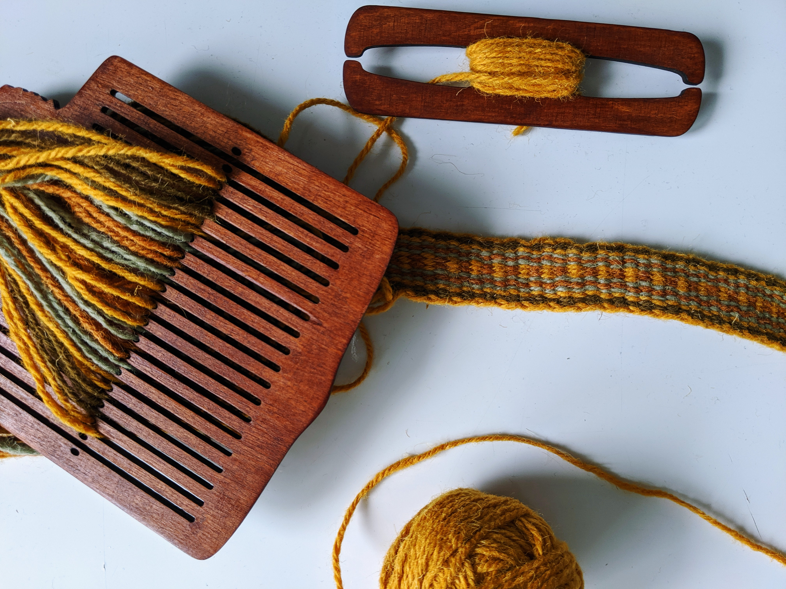
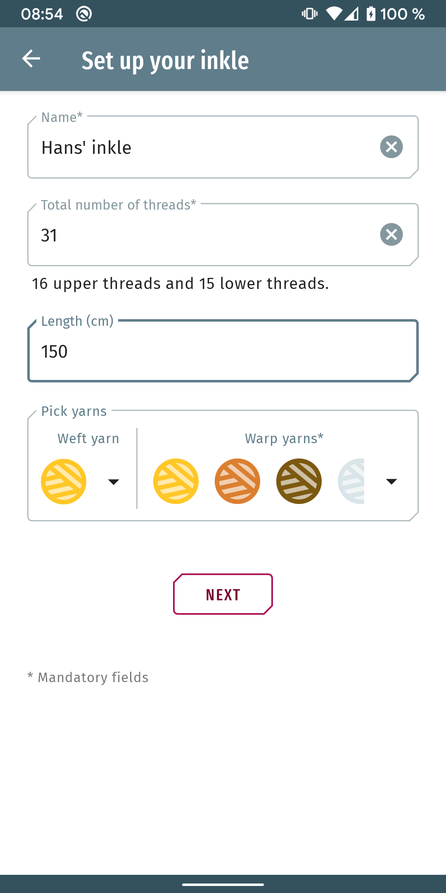
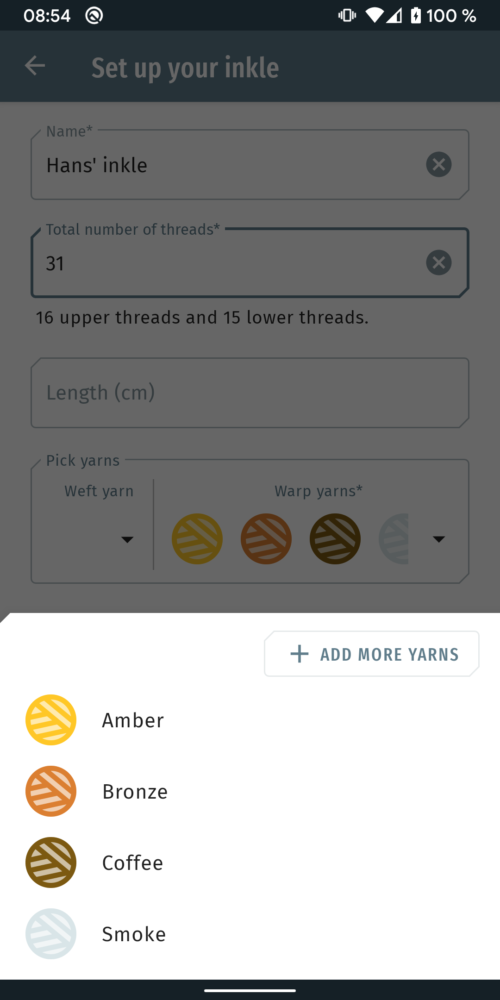
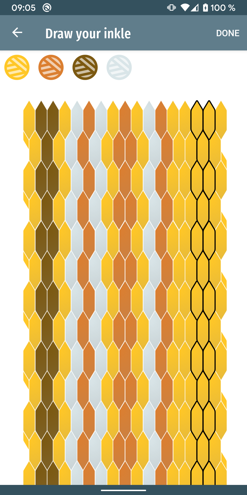
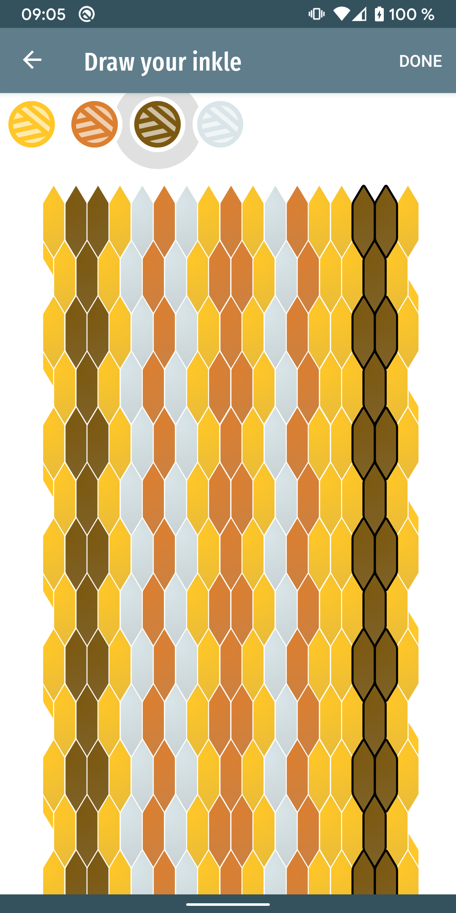
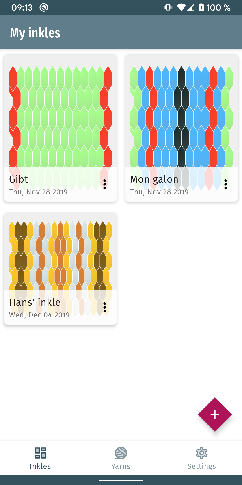
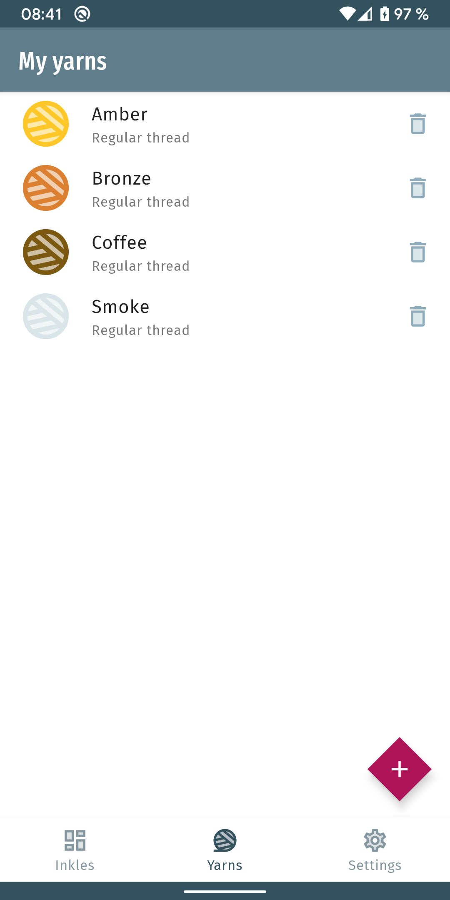
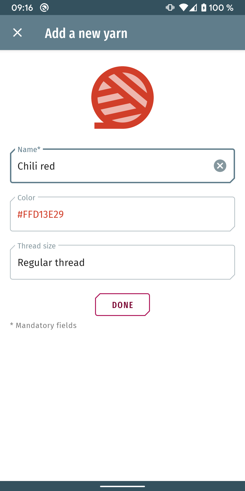

# Inkle Maker (currently in development)

Inkle Maker is an Android application to help inkle weavers prepare their tools and ideas in order to make beautiful creations.

Story
-----
An inkle is a weaved band of wool (or other fabric) that is used as clothes ornement in medieval outfits.

I recently learned how to weave them using a plain weaving loom and as I wanted to create a new inkle for a friend, we realized it took us way more time to decide and visualize the pattern and color we desired than to weave the actual thing.

From there came the idea of a generator to draw a preview of an inkle with basic settings: number of threads, yarns used, length.

Features
--------

#### Creating an Inkle

	
	
	
	
	

#### List of yarns

	
	

#### Still in development

- Edit or duplicate an inkle.
- Edit a yarn
- 3rd screen "Recap" of the "Create Inkle" flow:
	- summerize how much length per yarn is needed
	- generate the pattern draft (to help setting up the loom).
- Import/Export an inkle
